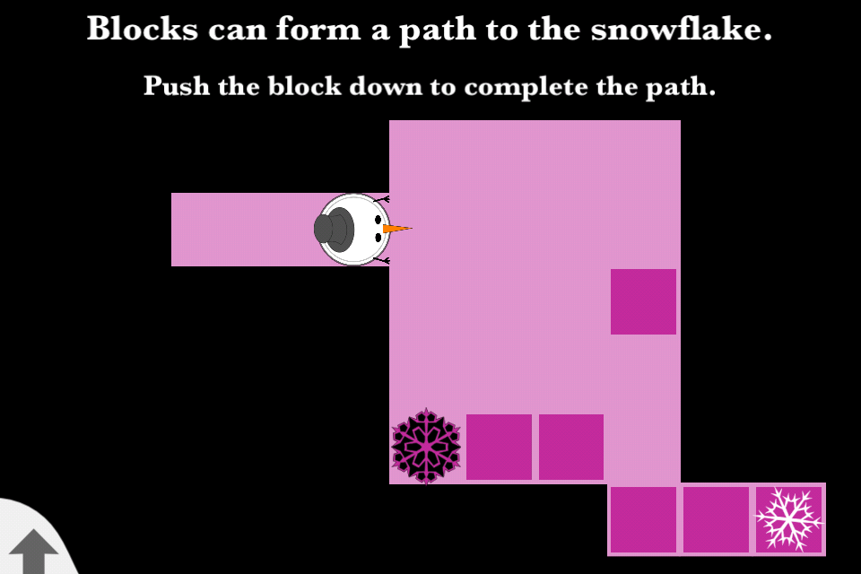
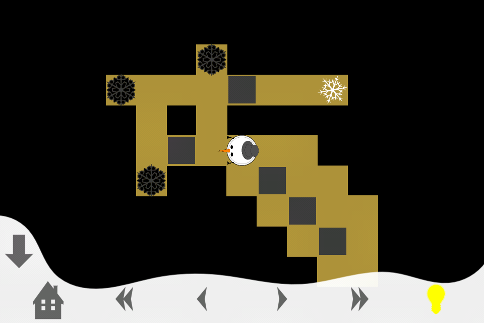
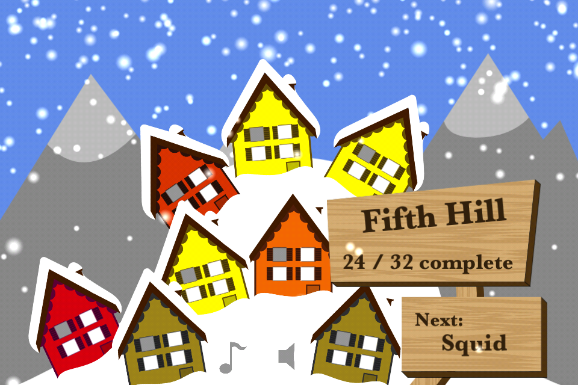

# We're Snowed In!

We're Snowed In! is a single-player puzzle game for iPhone and iPad. The core game mechanic is similar to [Sokoban](https://en.wikipedia.org/wiki/Sokoban), with the addition of special tiles that invert every square, turning blocks to empty spaces and vice-versa. The goal of every level is to guide the main character (a snowman) to the exit (a white snowflake).

 [Game Trailer](https://www.youtube.com/watch?v=map5AfHqwoQ) / [Gameplay Video](https://www.youtube.com/watch?v=WRV3uCAqYe8) 

> Image: Once the snowman pushes the fuscia block to the bottom of the screen, the inverter (bottom left) will turn the six blocks into a path to the exit (bottom right).

A primary design consideration was learnability; the inverting mechanic is a complex one and later levels are impossible to solve if the player cannot understand and predict what inverting will do many moves in advance. The game has a slow, steady learning curve that introduces strategies one by one and points users in the right direction. For later levels, a hint system lets users reveal parts of the solution to a difficult level.

> Image: A larger map. The path to the exit is blocked by a single block. VCR-style controls along the bottom of the screen let the user rewind and fast-forward through move history.

The focus of a puzzle game should be mastering a unique mechanic, not avoiding risk. We're Snowed In! is built to reward exploration and experimentation. VCR-style controls let the user rewind and fast-forward through their move history, play back past progress and undo their way out of traps that would otherwise be fatal (or require restarting). Knowing that a safe state is just a tap or two away makes users comfortable and willing to try things.

> Image: A menu showing four maps with associated difficulty levels.

As users complete the 104 levels, the world on the main menu screen changes: snow falls more heavily, coating the hills and houses, and a snowman is built piece by piece. Particle effects, parallax backgrounds and an alluring score give this game a unique charm.

> Image: The 'world' of the game gathers snow as the user makes progress.

### Interesting Code
If you want to read some code, here are some interesting points to jump in.

#### [GridLogicManager.m](https://github.com/wmatthew/snowed-in/blob/master/snowedin/GridLogicManager.m) (Obj-C)
The core logic of the game, where entities are moved around and collision/interaction behavior is defined. Move history and undo/redo logic is also defined here. 

#### [BoxLevel.m](https://github.com/wmatthew/snowed-in/blob/master/snowedin/BoxLevel.m) (Obj-C)
There are 104 levels parsed from text files; each one has its own set of hints, solution, level map, and title. The level object is responsible for parsing, validating and encapsulating that information.

#### [Entity](https://github.com/wmatthew/snowed-in/blob/master/snowedin/Entity.m) (Obj-C)
The ancestor from which all tile entities are descended. Defines basic movement behavior, rep invariant check, and delayed deletion logic. 

### Exclusions

At time of writing (June 2012) this project compiles and runs in my development environment. HOWEVER, this git repo excludes:

* All financial transaction code, for security reasons.
* The cocos2d library, available at http://www.cocos2d-iphone.org/
* The proprietary SquidMixer common library.

Without these, you will not be able to run this app in your simulator or on your device. Sorry. This repo is intended to show what I've built and how I've structured my code, not to distribute a fully-functional version of my app.

### Credits

All code and art assets are by Matthew Webber unless otherwise noted.
- Music by Kevin MacLeod (incompetech.com)
- MBProgressHUD by Matej Bukovinski
- Cocos2d by Ricardo Quesada (http://www.cocos2d-iphone.org)

### Related
- [We're Snowed In! Game Trailer](https://www.youtube.com/watch?v=map5AfHqwoQ)
- Level 8: "Snooze": [Video Walkthrough](https://www.youtube.com/watch?v=HaLCPn2PhIs) / [Source Code](https://github.com/wmatthew/snowed-in/blob/master/snowedin/levels/Level008)
- Level 26: "Bishop": [Video Walkthrough](https://www.youtube.com/watch?v=WRV3uCAqYe8) / [Source Code](https://github.com/wmatthew/snowed-in/blob/master/snowedin/levels/Level026)
- [This same writeup](http://m.atthe.ws/portfolio/snowedin), published on my portfolio.
  

